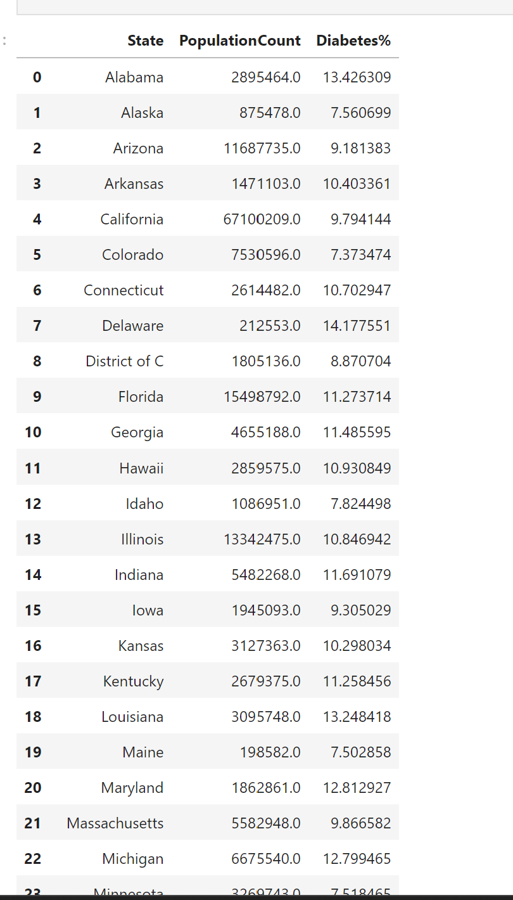
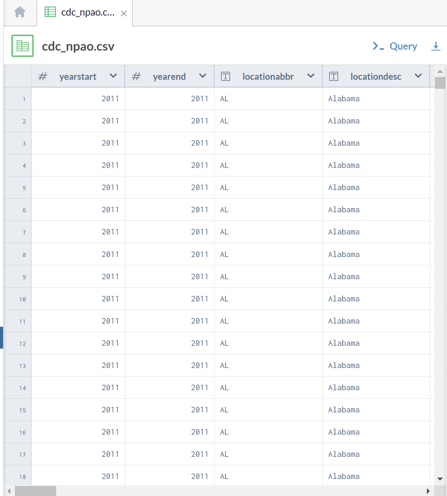
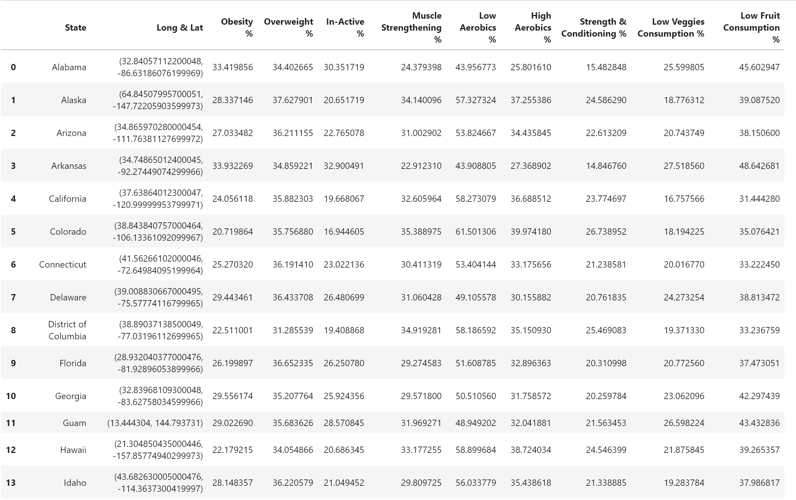
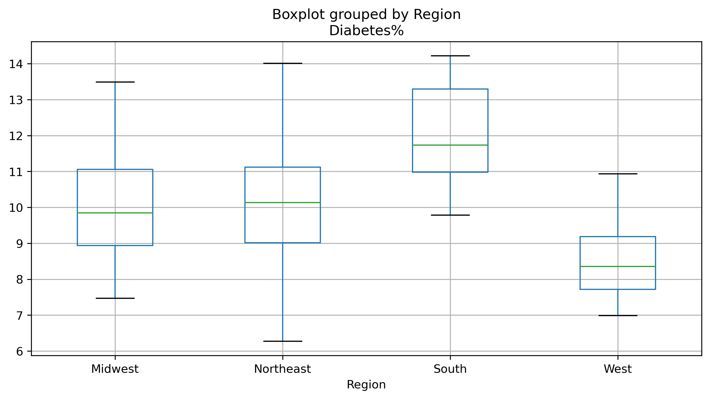

# Project 1: Rates of Diabetes in the United States
* Diabetes is a chronic disease that affects how the body turns food into energy. There are three main types of diabetes - type 1, 2, and gestational diabetes (diabetes while pregnant). According to CDC, more than 133 million in the United States live with diabetes, and 96 million out of 133 are US adults. 
* Based on studies conducted in the United States so far, there isn’t a specific cure for diabetes yet, but weight management, good nutrition, and being active can improve the health outcome of a diabetic patient. 
* While previous studies focused on data at the individual level, the focus of our study was to examine the relationship between physical activity, food nutrition, and obesity on diabetes prognosis at the state level. 

## Research Questions
1. What are the rates of diabetes in the US?
2. Are there any differences in rates of diabetes between the four major regions of the 
United States?
3. How strong is the relationship between nutrition, physical activity, obesity and diabetes at the state level?
4. Can we predict diabetes rates at the state level based on nutrition rate, physical activity rates, and obesity rates?

## Process
#### 1. Data Wrangling & Transformation
* Clean diabetes rate dataset.
* Clean nutrition, physical activity and dataset.
* Merged the two clean datasets.
#### 2. Descriptive Analytics
* Describe the rates of diabetes in United States.
* Compare rates among United States regions.
#### 3. Predictive Analytics
* Inspect relationship between nutrition, physical activity, obesity, and diabetes.
* Predict diabetes rates based on nutrition, physical activity, obesity and diabetes. 

## Understanding the Datasets
### Challenges
When researching the topic, we found multiple data sources but few captured the data we wanted to use.
We found two datasets that had the variables of interest, but they had different structures, and we needed to transform them to be a similar structure in order to merge them
### Dataset 1: 500 Cities: Adult Diabetes(csv)
Data was provided by the Centers for Disease Control and Prevention (CDC), Division of Population Health, Epidemiology and Surveillance Branch. This project explores diabetes rates at the city level and includes sample size and population
*Variables & Observations:*
This dataset displays 24 columns, 29,006 rows in table. This dataset measures 50 states and 2 other US owned territories.

after cleaning the data set and restructuring it:

### Dataset 2: Nutrition, Physical Activity, and Obesity (npao.csv)
2011 - 2015 data by state from the CDC Behavioral Risk Factor Surveillance System (BRFSS). Covers questions on nutrition, physical activity, and obesity.
*Variables  &  Observations:*
This dataset displays 33 columns, 48,772 rows in table. 
This dataset measures 50 states and 4 other US owned territories.

after cleaning the data set and restructuring it:

## Descriptive Analytics

Most of the South region states with few Northeast & Midwest region states showed to have high diabetes rate.

The West region states (combination of West and Midwest) showed to have low diabetes rates, with the exception of Vermont and Maine state that are in the Northeast region.

The following map shows the rates of diabetes across the United States

We grouped the data into the 4 regions of the US and compare the rates of diabetes across the states.

We found that there is a significant difference in the rates of diabetes between the different US regions.
According to the graph below, the west region has the lowest diabetes rates, and the south has the highest rates of diabetes.

## Predictive Analytics
The linear regression method is leveraged to study the relationship between nutrition, physical activity, obesity, and diabetes. The Pearson correlation coefficients are calculated between each pair of variables to determine how strong the relationship of the three independent indicators is to diabetes rates.

#### For Obesity Indicator
The relationship between diabetes rates and the percentage of adults who are overweight and obese is studied.

#### For Exercise Indicator
We explored the relationship between diabetes rates:
- Percent of adults who do not exercise
- Percent of adults who do muscle strengthening workouts 2+ times/week
- Percent of adults who engage in aerobic exercise, 150 min/week
- Percent of adults who engage in aerobic exercise, 300
- Percent of adults who engage in aerobic exercise, 150 min/week, and do muscle training 2+ times/week.

#### For Nutrition Indicator
The relationship between diabetes rates  and the percent of adults who consume less than one fruit a day and less than one vegetable a day is studied.

Overall, there are moderate correlations between most of our indicators and diabetes (|0.45|< r <|0.71|). Due to the strong correlations among all indicators, we selected one analysis category from each indicator grouping as a predictor in a regression model.

#### Predicting Diabetes Based on Obesity 
The correlation between diabetes and obesity is moderate (r=0.52). Higher obesity rates in the states in 2011-2015 predict higher diabetes rates in 2016-2017.

### Predicting Diabetes Based on Nutrition
The correlation between diabetes and low vegetable consumption is moderate (r = 0.56). Higher rates of low vegetable consumption in the years 2011-2015 predict higher diabetes rates in the years 2016 -2017

### Predicting Diabetes Based on Exercise
The correlation between diabetes and inactivity is strong (r = 0.71). Higher rates of adults who are inactive in the states in the years 2011-2015 predict higher diabetes rates in the years 2016-2017.

## Summary
- We determined an average diabetes of 10.3% across the fifty states in the United States.
- There is a significant difference in rates of diabetes in the four regions. The south region had the highest diabetes average rate of 12.1%, and the West with the lowest average rate of 8.6%. And the Northeast and Midwest have an average rate of 10.1%.
- Nutrition, physical activity, and obesity are highly correlated.
- Obesity rates in the states explain 27% of the variability in diabetes rates.
- Inactivity rates in the states show 51% of the variability in diabetes rates.
- Low vegetable consumption rates in the states show 31% of the variability in diabetes rates.

In conclusion, our study does support the hypothesis that good nutrition, exercise, and good weight management help to improve the health of a diabetic patient.
